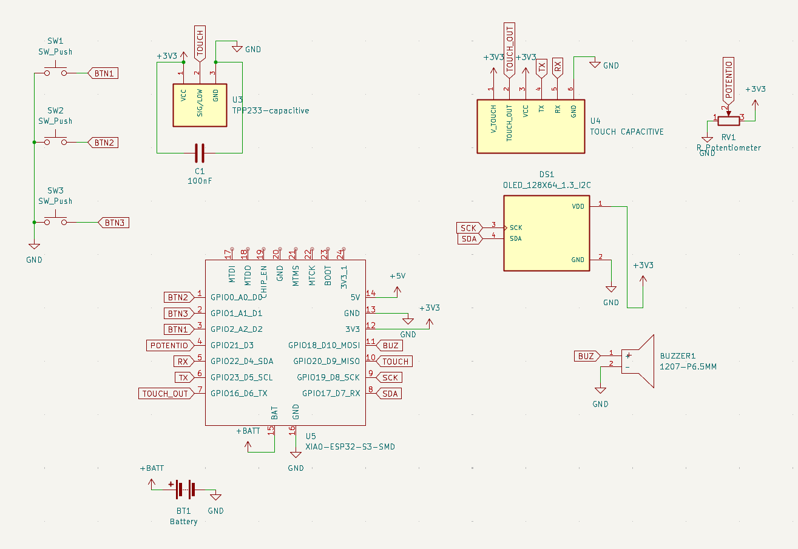
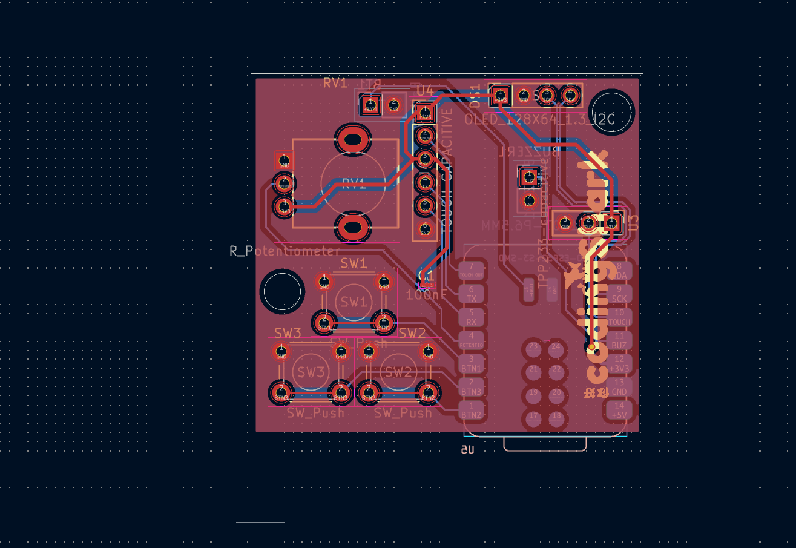
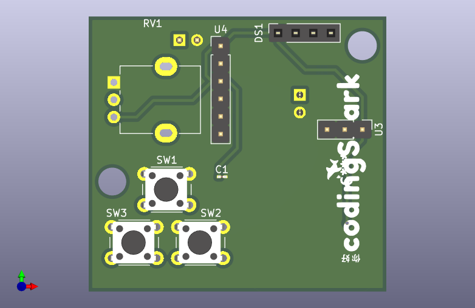

# MAJIGOTCHA!
MAJIGOTCHA is a handheld digital pet in a small, bear head-shaped device. Users nurture a virtual creature from hatching through different life stages by feeding, cleaning, and playing with it using three buttons. Proper care determines its growth, while neglect can cause it to die.

## why MAJIGOTCHA?
can't afford the real tamagotchi? yeah that is why i build my own, it is not tamagotchi it is MAJIGOTCHA, it has my dream features such fingerprint and touch sensor, i make this because my sister is really dream to have a tamagotchi but since it is too expensive to buy i prefer make this by my self, since i want something more than just a tamagotchi.

## features
this is the first version of MAJIGOTCHA! it has really great features lemme break down:
> touch sensor, this mean you could pat your pet! tame it!

> fingerprint sensor, make it only yours..it will recognizes your fingerprint and can only be tamed with you.

> potentiometer scroll, since this MAJIGOTCHA has more complex features, the screen-menu could be navigate by potentiometer and button.

> in future i will upgrade this MAJIGOTCHA firmware to OTA and various casing.

## code example, pcb and schema
i made the case using [onshape](https://onshape.com) and here is the document link [MAJIGOTCHA-case](https://cad.onshape.com/documents/353c81332f9ae163598e6183/w/df33fd15e80ae307a4e30d2f/e/6c68072ba9f649a3b4a35ab0)
i am using RV09 vertical potentiometer so it will be solderen onPCB and for things such OLED, TTP223, HLK-ZW101 i use pinHeader 2.54 instead

in this schema i'm using global labels since it is easier to understand and to read, for the PCB it is 2 layer, and contain vias, the pcb's size is not more than 50mmx50mm which it resulting in cheaper price.



this MAJIGOTCHA is similar to tamagotchi BUT it is has more unique features, in here every stats even tame, inTamingProgress or notTame is has it own sprite, here is the bitmaps example:
```
const unsigned char PROGMEM notTame[] = {
  0b00000000, 0b00000000,
  0b00000000, 0b00000000,
  0b00001100, 0b01100000,
  0b00010011, 0b10010000,
  0b00010000, 0b00010000,
  0b00100100, 0b01001000,
  0b00010010, 0b10010000,
  0b00010000, 0b00010000,
  0b00001000, 0b00100000,
  0b00000111, 0b11000000,
  0b00001000, 0b00100000,
  0b00010100, 0b01010000,
  0b00010010, 0b10010000,
  0b00001100, 0b01100000,
  0b00010011, 0b10010000,
  0b00001100, 0b01100000
};
```
in notTame stat it means you rarely identify your fingerprint and interact with him, remember it is only you and some of your friends fingerprint! other than that he will very very badMood!
```
const unsigned char PROGMEM curious[] = {
  0b00000000, 0b00000000,
  0b00000000, 0b00000000,
  0b00001100, 0b01100000,
  0b00010011, 0b10010000,
  0b00010000, 0b00010000,
  0b00001010, 0b10100000,
  0b00010010, 0b10010000,
  0b00010000, 0b00010000,
  0b00001000, 0b00100000,
  0b00000111, 0b11000000,
  0b00001000, 0b00100000,
  0b00010100, 0b01010000,
  0b00010010, 0b10010000,
  0b00001100, 0b01100000,
  0b00010011, 0b10010000,
  0b00001100, 0b01100000
};
```
curious stat is when his tame progress is around 50 like more than 30 but less than 50, he starts curious with you! keep interact with him until he is happy!
```
const unsigned char PROGMEM happy[] = {
  0b00000000, 0b00000000,
  0b00000000, 0b00000000,
  0b00001100, 0b01100000,
  0b00010011, 0b10010000,
  0b00010000, 0b00010000,
  0b00001010, 0b10100000,
  0b00010001, 0b00010000,
  0b00010000, 0b00010000,
  0b00001000, 0b00100000,
  0b00000111, 0b11000000,
  0b00001000, 0b00100000,
  0b00010100, 0b01010000,
  0b00010010, 0b10010000,
  0b00001100, 0b01100000,
  0b00010011, 0b10010000,
  0b00001100, 0b01100000
};
```
if you reached happy! it means he likes you so much and he is happy to be with you! keep it like this and you both will be good friends!

## components
| no    | name  | qty | price in idr |
|-------|------------------------------------------------------------------------------------------------------------------------------------------------------------------------------------------------------------------------------------------------------------------------------------------------------------------------------------------------------------------------------|-----|--------------|
| 1     | [seeeduino xiao esp32-c6](https://shopee.co.id/Pre-Soldered-Seeeduino-Xiao-ESP32-C3-C6-S3-nRF52840-Mini-Development-Board-wifi-module-bluetooth5.0-i.1733652584.44605902551?extraParams=%7B%22display_model_id%22%3A315532221124%2C%22model_selection_logic%22%3A3%7D&sp_atk=1e86e1a1-d50f-4ddf-872c-1a7bf0063a2c&xptdk=1e86e1a1-d50f-4ddf-872c-1a7bf0063a2c)                | 1   | 125000       |
| 2     | [OLED 1.3inch 4 pin](https://shopee.co.id/Oled-1.3-inch-White-128X64-LCD-LED-Display-I2C-SPI-i.29614947.15299206834?extraParams=%7B%22display_model_id%22%3A286380108800%2C%22model_selection_logic%22%3A2%7D&sp_atk=5581b29f-11be-4425-b561-856e9085b63b&xptdk=5581b29f-11be-4425-b561-856e9085b63b)                                                                        | 1   | 60000        |
| 3     | [LiPo battery 1000mAh 3.7V](https://shopee.co.id/Baterai-lithium-polimer-1000mah-523450-1500mah-803450-i.6828741.7404713970?extraParams=%7B%22display_model_id%22%3A200235569624%2C%22model_selection_logic%22%3A2%7D&sp_atk=97c69378-6d19-4a8a-8440-88d717dd88a4&xptdk=97c69378-6d19-4a8a-8440-88d717dd88a4)                                                                | 1   | 70000        |
| 4     | [SW Push Tactile button](https://shopee.co.id/Tombol-Reset-saklar-Tactile-Push-Button-Micro-Switch-6x6-mm-4Pin-DIP-i.7849796.24862806415?extraParams=%7B%22display_model_id%22%3A99512365459%2C%22model_selection_logic%22%3A2%7D&sp_atk=b424789e-79b1-47b6-bc5c-de19a421847f&xptdk=b424789e-79b1-47b6-bc5c-de19a421847f)                                                    | 3   | 12000        |
| 5     | [RV09 20k Potentiometer](https://shopee.co.id/Potentiometer-Potensiometer-RV09-potensio-Mono-1-2-5-10-20-50-100-K-i.48406045.22301052102?extraParams=%7B%22display_model_id%22%3A230048446464%2C%22model_selection_logic%22%3A3%7D&sp_atk=1b9f26a0-71eb-4422-b890-36847dca0c69&xptdk=1b9f26a0-71eb-4422-b890-36847dca0c69)                                                   | 1   | 8000         |
| 6     | [TP223 capacitive touch sensor](https://shopee.co.id/MERAH-Saklar-Sentuh-Touch-Sensor-Capacitive-TTP223-Switch-Arduino-i.6406600.1153531563?extraParams=%7B%22display_model_id%22%3A41163384882%2C%22model_selection_logic%22%3A3%7D&sp_atk=5572a8bb-4cf4-4d05-ab05-ae396874a5bd&xptdk=5572a8bb-4cf4-4d05-ab05-ae396874a5bd)                                                 | 1   | 2000         |
| 7     | [HLK-ZW101 capacitive fingerprint](https://shopee.co.id/modul-fingerprint-capacitive-fingerprint-sensor-modul-kapasitas-50-profil-sidik-jari-support-arduino-esp32-i.108345327.28986833146?extraParams=%7B%22display_model_id%22%3A280149142816%2C%22model_selection_logic%22%3A3%7D&sp_atk=1f3d0cd1-fd72-4985-a735-fcf4e80ae198&xptdk=1f3d0cd1-fd72-4985-a735-fcf4e80ae198) | 1   | 120000       |
| 8     | [2.54 pin header](https://shopee.co.id/PIN-HEADER-MALE-STRIP-SINGLE-ROW-1X40-2.54MM-BLACK-HITAM-FOR-ARDUINO-MINI-NANO-i.62956347.5909650283?extraParams=%7B%22display_model_id%22%3A181542147744%2C%22model_selection_logic%22%3A2%7D&sp_atk=9b956594-5a8c-426c-a2a4-4f187335748b&xptdk=9b956594-5a8c-426c-a2a4-4f187335748b)                                                | 40  | 10000        |
| 9     | [female to female cable](https://shopee.co.id/Kabel-Jumper-40PCS-20CM-Male-to-Female-Female-to-Female-Male-to-Male-Dupont-%E2%80%93-Kabel-Koneksi-untuk-Breadboard-i.62956347.1063975553?extraParams=%7B%22display_model_id%22%3A270485393609%2C%22model_selection_logic%22%3A2%7D&sp_atk=fc82f2e6-d9de-483c-b11d-0f5a3227d0cb&xptdk=fc82f2e6-d9de-483c-b11d-0f5a3227d0cb)   | 40  | 10000        |
| 10    | [passive piezoelectric buzzer](https://shopee.co.id/Passive-Buzzer-3-12V-16-Ohm-BAGUS-12X8.5-mm-Pasive-Buzer-Pasif-Buser-i.193335132.52301383875?extraParams=%7B%22display_model_id%22%3A109588483742%2C%22model_selection_logic%22%3A3%7D&sp_atk=e76a41ab-416d-4e86-8c9f-0587ee075cda&xptdk=e76a41ab-416d-4e86-8c9f-0587ee075cda)                                           | 1   | 2000         |
| 11    | [female pin header (pin socket)](https://shopee.co.id/1x40p-Female-Pin-Header-2.54mm-40-Pin-Single-Row-PCB-Connector-Betina-i.6406600.1153531501?extraParams=%7B%22display_model_id%22%3A41163261938%2C%22model_selection_logic%22%3A3%7D&sp_atk=af0e8d18-340d-418a-b709-74f619aaadf8&xptdk=af0e8d18-340d-418a-b709-74f619aaadf8)                                            | 20  | 10000        |
| 12    | [connector XH2P housing](https://shopee.co.id/CONNECTOR-XH2.54-4P-PIN-FEMALE-20CM-CABLE-JST-2.54MM-SOCKET-CON-STOCKO-i.62956347.23700082559?extraParams=%7B%22display_model_id%22%3A49121904954%2C%22model_selection_logic%22%3A2%7D&sp_atk=69be3aae-f4b3-48a3-bb47-8a4b6dcf66db&xptdk=69be3aae-f4b3-48a3-bb47-8a4b6dcf66db)                                                 | 20  | 10000        |
| 13    | [jlcpcb](https://jlcpcb.com)                                                                                                                                                                                                                                                                                                                                                 | 5   | 65000        |
| 14    | [case](https://shopee.co.id/Jasa-Cetak-3D-Print-PLA-PLA-PETG-ABS-TPU-Nylon-Carbon-Fiber-Multicolor-Polycarbonate-Resin-i.81557195.43001716747?extraParams=%7B%22display_model_id%22%3A265141036120%2C%22model_selection_logic%22%3A3%7D&sp_atk=bbc55b01-5719-43ed-ab66-7336188997fe&xptdk=bbc55b01-5719-43ed-ab66-7336188997fe)                                              | 1   | 40000        |
| total | Rp.544.000
